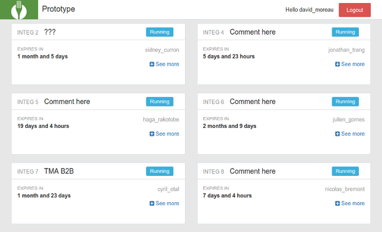

```
    ____             __        __
   / __ \_________  / /_____  / /___  ______  ___
  / /_/ / ___/ __ \/ __/ __ \/ __/ / / / __ \/ _ \
 / ____/ /  / /_/ / /_/ /_/ / /_/ /_/ / /_/ /  __/
/_/   /_/   \____/\__/\____/\__/\__, / .___/\___/
                               /____/_/
```
[](https://travis-ci.org/lafourchette/prototype)
[](https://scrutinizer-ci.com/g/lafourchette/prototype/?branch=master)
[](https://scrutinizer-ci.com/g/lafourchette/prototype/?branch=master)

## Introduction
Prototype was created to help product owner to test their production in a full stack environnement.

* Start/Stop/Build VMs at ease
* LDAP auth
* Automatic mail alert on events (start, stopped, expired)

Check our [awesome contributors](https://github.com/lafourchette/prototype/graphs/contributors) !



## Installation
After cloning the repository:
```bash
make build
```
Then edit config.json
```javascript
"provisioners":[{
    "type": "local", // local file
    "path": "."
},{
    "type":"github", // github remote file
    "repository":"",
    "path":"",
    "token":"",
    "user":""
}]
```
And serve it with a webserver, for example
```bash
php -S localhost:8000 -t web
```

## Contributing
Who's who:
- A **Prototype** is a Virtual Machine instance where your project to test lives.
- A **Location** is a server or a local directory where the Prototype is running.
- A **Provisioner** describes how to create a Prototype.
